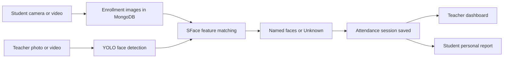

# NETRIKA

### See. Recognise. Record.

NETRIKA is a face-recognition attendance application built with **YOLO, OpenCV SFace, FastAPI, and MongoDB**. Students enroll their faces using camera captures or video uploads. Teachers submit a group photo or short video to identify enrolled students, label unmatched faces as **Unknown**, and save an attendance report.

> Face recognition uses **SFace**. Real crowd-recognition accuracy has not yet been benchmarked.

## Features

| Students | Teachers |
| --- | --- |
| Register and log in | Log in with administrator credentials |
| Enroll with four guided camera poses or a video | Upload a group photo or a short video |
| Replace previous face images after a completed update | Identify enrolled faces and label unmatched faces Unknown |
| View personal attendance analytics and reports | Automatically save attendance for each upload |
| Reset a forgotten password by email | View attendance analytics and student reports |

- **Live dashboard updates:** attendance analytics refresh every 15 seconds while the tab is visible.
- **Read-only student reports:** students can access only their own attendance records.
- **Persistent storage:** MongoDB GridFS stores face images and annotated results.
- **Guided capture:** progress moves from 0% to 100% across Front, Left, Right, and Smile frames.
- **Docker setup:** FastAPI and MongoDB run together with persistent database storage.

## How it works



Each successful teacher upload creates one attendance session. Matched students are marked **Present**; other registered students are marked **Not detected**. Repeated appearances within a video mark the same student only once, using the student's database ID.

## Technology

| Layer | Tools |
| --- | --- |
| Frontend | HTML, CSS, JavaScript |
| API | FastAPI, Uvicorn |
| Face detection | Ultralytics YOLO |
| Face recognition | OpenCV SFace |
| Database | MongoDB, GridFS |
| Authentication | Session cookies, hashed passwords |
| Local deployment | Docker Compose |

## Quick start with Docker

Install Docker Desktop and start it with Linux containers enabled.

```bash
git clone https://github.com/PranathiNP/Netrika.git
cd Netrika
```

Copy `.env.example` to `.env` and set your configuration:

```powershell
Copy-Item .env.example .env
```

On macOS or Linux, use `cp .env.example .env`.

Set a strong, random `SECRET_KEY` and choose your own `TEACHER_USERNAME` and `TEACHER_PASSWORD`. Then run:

```bash
docker compose up --build -d
```

Open **http://localhost:8080**. The initial build downloads the runtime dependencies and may take several minutes. No GPU is required.

```bash
docker compose logs -f app
docker compose down
```

The named MongoDB volume preserves data when containers stop. The Docker database starts empty and does not automatically import an existing local MongoDB database.

## Run without Docker

Install Python and start a local MongoDB server. Create `.env` from `.env.example`, then run:

```powershell
python -m venv .venv
.\.venv\Scripts\python.exe -m pip install -r requirements.txt
.\.venv\Scripts\python.exe app.py
```

Open **http://127.0.0.1:8000**. Docker uses Python 3.11; the Windows development environment has also been tested with Python 3.14.

## Configuration

| Variable | Purpose |
| --- | --- |
| `SECRET_KEY` | Random secret used to sign session cookies |
| `MONGODB_URI` | MongoDB connection URI; Compose overrides this to use its database container |
| `MONGODB_DB` | Database name; defaults to `netrika` |
| `TEACHER_USERNAME`, `TEACHER_PASSWORD` | Teacher login credentials |
| `SMTP_HOST`, `SMTP_PORT`, `SMTP_USER`, `SMTP_PASSWORD` | Email delivery settings |
| `SMTP_FROM` | Sender address for application emails |
| `APP_BASE_URL` | Address used in password-reset links; set to your running app's URL |
| `COOKIE_SECURE` | Set to `true` when serving the app over HTTPS |
| `FACE_MATCH_THRESHOLD` | Minimum face similarity score; defaults to `0.50` |
| `FACE_MATCH_MARGIN` | Required score separation between competing matches; defaults to `0.08` |

Keep `.env` private; it is excluded from Git and the Docker image. Real SMTP credentials are required for student recovery emails. Teacher password recovery is disabled.

## Upload limits and current scope

| Input | Limit |
| --- | --- |
| Student enrollment video | 15 seconds, 30 MB; samples up to 12 frames |
| Student camera capture | Four guided poses; exactly one detected face per frame |
| Teacher recognition video | Five seconds, 30 MB |
| Teacher recognition photo | 30 MB |

- The application currently uses one global student roster. Courses and scheduled classes are not modeled.
- **Not detected does not prove absence.** Face size, lighting, occlusion, and enrollment quality affect matching.
- A simulated 40-face test verifies processing logic, not identification accuracy on a real 40-person crowd.
- Camera poses are user-guided; the detector checks for one face, not whether the person is smiling.
- YuNet landmarks align each face before SFace extraction. Faces below 40 pixels or without reliable landmarks remain Unknown. A student ID is assigned at most once per frame; competing matches with insufficient score separation are rejected.
- New annotated videos use H.264 MP4 with fast-start metadata and byte-range delivery for browser playback and seeking. Older results must be regenerated to use the new encoding.
- This Docker configuration runs locally. It does not publish a website to the internet.

## Verification

With MongoDB running, install the test client dependency and run:

```powershell
.\.venv\Scripts\python.exe -m pip install httpx
.\.venv\Scripts\python.exe -m unittest test_face_matching test_attendance test_dashboard_updates -v
```

Tests use a temporary `netrika_test_*` database and delete it afterward. They cover attendance persistence, student access restrictions, video enrollment storage, face-image replacement, capture progress, and student password recovery. Email and identity inference are mocked for deterministic tests.

Docker smoke checks have also verified container health, homepage responses, MongoDB connectivity, YOLO inference, and SFace feature extraction.

## Project files

```text
app.py                       FastAPI routes and recognition workflow
password_reset.py            Student email recovery
index.html                   Landing page and login
student.html / teacher.html  Role-specific dashboards
attendance.js                Reports and analytics
Dockerfile / compose.yaml    Container setup
test_attendance.py           Attendance regression tests
test_dashboard_updates.py    Recovery and enrollment regression tests
```

See [Docker instructions](DOCKER.md), [attendance workflow](ATTENDANCE_GUIDE.md), and [database setup](DATABASE_SETUP_GUIDE.md) for more detail.

## Performance and maintenance

Enrollment embeddings are cached in image metadata after first use. Model file fingerprints and a preprocessing version invalidate the derived cache when needed. Each recognition request reads the current student and active-image records, so deleted or pending enrollment images are not reused. Corrupt image files are skipped. The original images and all features remain available.

Dashboard polling continues every 15 seconds, but unchanged reports do not rebuild the tables and charts. Docker installs CPU PyTorch in a separate layer so ordinary dependency changes can reuse it, and copies assets with their final ownership to avoid duplicating model files in a later ownership-change layer. Build context remains restricted to runtime files.

Run `python -m unittest test_feature_store test_face_matching test_media_delivery test_attendance test_dashboard_updates -v` for the full regression suite. Feature caching adds a small amount of derived metadata to MongoDB in exchange for avoiding repeated model inference.
